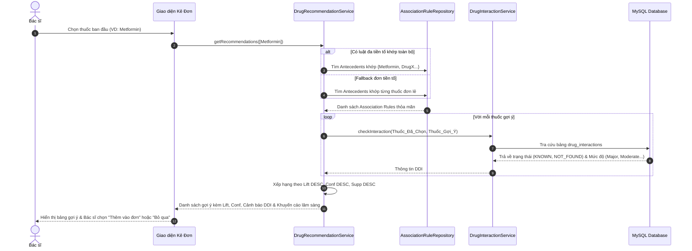

# KIẾN TRÚC HỆ THỐNG (SYSTEM ARCHITECTURE)

---

## 1. Tổng quan Kiến trúc Hệ thống

Hệ thống được thiết kế theo mô hình **Kiến trúc phân tầng chuẩn doanh nghiệp (Layered Enterprise Architecture)** kết hợp với **Data Mining Engine độc lập thuần Java**.

Hệ thống đảm bảo:
1. **100% Java Runtime**: Không phụ thuộc vào Python, R hay bất kỳ tiến trình ngoại vi nào khi khai phá dữ liệu hoặc vận hành ứng dụng.
2. **Không gọi API AI/LLM bên thứ ba**: Toàn bộ gợi ý kê đơn thuốc xuất phát từ các luật kết hợp khai phá được từ dữ liệu bệnh viện thực tế.
3. **Phân tách trách nhiệm rõ ràng (Separation of Concerns)** giữa nghiệp vụ quản lý bệnh viện và phân hệ khai phá dữ liệu.

```mermaid
graph TD
    subgraph Client Layer
        WebUI[Web Browser / Thymeleaf + Bootstrap + Chart.js]
    end

    subgraph Controller Layer
        AuthCtrl[AuthController]
        DashCtrl[DashboardController]
        MiningCtrl[MiningController]
        PrescCtrl[PrescriptionController]
        ApiCtrl[MiningApiController / RecommendationApi]
    end

    subgraph Service Layer - Data Mining & ML
        ImportSvc[DatasetImportService]
        PreprocSvc[DataPreprocessingService]
        TxBuilder[TransactionBuilderService]
        AprioriSvc[AprioriMiningService]
        FPGrowthSvc[FPGrowthMiningService]
        EvalSvc[MiningEvaluationService]
        RuleSvc[AssociationRuleService]
    end

    subgraph Service Layer - Clinical & Hospital
        RecSvc[DrugRecommendationService]
        DdiSvc[DrugInteractionService]
        DocSvc[DoctorService]
        PatSvc[PatientService]
        VisitSvc[MedicalVisitService]
    end

    subgraph Persistence Layer - Spring Data JPA
        Repo[Repositories: TransactionRepo, AssociationRuleRepo, MedicineRepo, DrugInteractionRepo...]
    end

    subgraph Database Layer
        MySQL[(MySQL Database / H2 in-memory)]
    end

    WebUI --> Controller Layer
    Controller Layer --> Service Layer - Data Mining & ML
    Controller Layer --> Service Layer - Clinical & Hospital
    RecSvc --> RuleSvc
    RecSvc --> DdiSvc
    Service Layer - Data Mining & ML --> Persistence Layer - Spring Data JPA
    Service Layer - Clinical & Hospital --> Persistence Layer - Spring Data JPA
    Persistence Layer - Spring Data JPA --> Database Layer
```

---

## 2. Cấu trúc Gói Mã nguồn (Package Structure)

Mã nguồn được tổ chức trong package gốc `com.hospital.datamining`:

```text
com.hospital.datamining/
├── config/
│   ├── SecurityConfig.java              # Cấu hình Spring Security (phân quyền ROLE_ADMIN, ROLE_DOCTOR)
│   ├── PasswordEncoderConfig.java       # BCryptPasswordEncoder
│   └── WebMvcConfig.java                # Cấu hình đường dẫn tài nguyên tĩnh
├── controller/
│   ├── AuthController.java              # Đăng nhập, đăng xuất, chuyển hướng người dùng
│   ├── DashboardController.java         # Thống kê tổng quan, biểu đồ Chart.js
│   ├── DatasetController.java           # Quản lý nhập file CSV và thống kê Data Understanding
│   ├── MiningController.java            # Khởi chạy Apriori, FP-Growth, xem luật, benchmark
│   ├── PrescriptionController.java      # Giao diện kê đơn của bác sĩ, gợi ý thuốc
│   └── api/
│       ├── MiningApiController.java     # REST API khai phá dữ liệu
│       └── RecommendationApiController.java # REST API gợi ý thuốc theo thời gian thực
├── dto/
│   ├── AssociationRuleDTO.java          # Truyền tải thông tin luật kết hợp
│   ├── BenchmarkComparisonDTO.java      # So sánh hiệu năng Apriori vs FP-Growth
│   ├── DrugInteractionDTO.java          # Cảnh báo tương tác thuốc DDI
│   ├── DrugRecommendationDTO.java       # Gợi ý thuốc kèm Support, Confidence, Lift, DDI
│   └── PreprocessSummaryDTO.java        # Tóm tắt kết quả tiền xử lý dataset
├── entity/
│   ├── User.java, Role.java             # Quản lý người dùng và vai trò
│   ├── Patient.java, Doctor.java        # Thực thể bệnh nhân và bác sĩ
│   ├── MedicalVisit.java                # Lượt khám bệnh lâm sàng
│   ├── Medicine.java                    # Danh mục thuốc chuẩn hóa
│   ├── Prescription.java, PrescriptionItem.java # Đơn thuốc và chi tiết đơn
│   ├── DatasetImport.java               # Lịch sử nạp dữ liệu CSV
│   ├── DatasetStatistics.java           # Thống kê phân phối độ tuổi, chẩn đoán, số thuốc
│   ├── Transaction.java, TransactionItem.java   # Bản ghi giao dịch điều trị và các thuốc
│   ├── MiningRun.java                   # Lịch sử phiên khai phá thuật toán
│   ├── FrequentItemset.java, FrequentItemsetItem.java # Tập mục phổ biến
│   ├── AssociationRule.java, AssociationRuleItem.java # Luật kết hợp chuẩn hóa CSDL
│   └── DrugInteraction.java             # Cặp tương tác thuốc và mức độ cảnh báo DDI
├── repository/
│   ├── TransactionRepository.java       # Truy vấn giao dịch theo importId
│   ├── AssociationRuleRepository.java   # Tìm kiếm luật kết hợp theo vị từ (Antecedents)
│   ├── DrugInteractionRepository.java   # Tra cứu tương tác cặp thuốc
│   └── ... (21 Spring Data JPA Repositories)
├── service/
│   ├── importer/
│   │   └── DatasetImportService.java    # Nhận dạng và nạp tệp CSV
│   ├── preprocessing/
│   │   ├── DataPreprocessingService.java # Lọc, làm sạch, thống kê phân phối
│   │   ├── DrugNormalizationService.java # Chuẩn hóa tên thuốc
│   │   ├── TransactionBuilderService.java # Gom encounter_id thành Transaction (>= 2 thuốc)
│   │   └── TransactionService.java      # Quản lý tập giao dịch đang hoạt động
│   ├── mining/
│   │   ├── AssociationMiningService.java # Interface khai phá (Strategy Pattern)
│   │   ├── AprioriMiningService.java    # Triển khai thuật toán Apriori
│   │   ├── FPGrowthMiningService.java   # Triển khai thuật toán FP-Growth & FP-Tree
│   │   ├── AssociationRuleService.java  # Quản lý, lưu trữ và lọc luật kết hợp
│   │   ├── MiningEvaluationService.java # Đo lường Runtime, RAM, so sánh thực nghiệm
│   │   └── MiningRunService.java        # Lưu vết các phiên chạy vào CSDL
│   ├── prescription/
│   │   ├── DrugRecommendationService.java # Động cơ gợi ý thuốc 2 tầng (Multi + Fallback)
│   │   └── PrescriptionService.java     # Nghiệp vụ kê đơn
│   └── interaction/
│       └── DrugInteractionService.java  # Tra cứu cảnh báo tương tác FDA DDI
└── exception/
    └── GlobalExceptionHandler.java      # Xử lý ngoại lệ tập trung
```

---

## 3. Quy trình Vận hành Dữ liệu (Data Flow)

### 3.1. Luồng Nạp & Tiền Xử Lý Dữ Liệu (ETL & Preprocessing Pipeline)
1. Quản trị viên tải file `diabetic_data.csv` lên qua giao diện Web hoặc ứng dụng tự nạp từ đường dẫn cấu hình `dataset.path`.
2. `DataPreprocessingService` sử dụng Apache Commons CSV theo cơ chế **Streaming Parser**:
   * Đọc từng dòng mà không nạp toàn bộ tệp 19.1 MB vào bộ nhớ RAM cùng lúc.
   * Kiểm tra tính hợp lệ của trường `encounter_id` và `patient_nbr`.
   * Quét 23 cột thuốc điều trị đái tháo đường cụ thể theo quy ước: `No` = không dùng; `Steady`, `Up`, `Down` = có sử dụng (cùng 2 thuộc tính tóm tắt `change` và `diabetesMed`).
   * Tính toán các chỉ số Data Understanding: phân bố nhóm tuổi, top chẩn đoán, số thuốc TB/min/max.
3. `TransactionBuilderService`:
   * Gom các thuốc có sử dụng theo từng `encounter_id`.
   * Lọc bỏ các encounter có $< 2$ thuốc (chỉ giữ lại encounter có $\ge 2$ thuốc cho bài toán đồng sử dụng thuốc).
   * Lưu các giao dịch hợp lệ vào 2 bảng `transactions` và `transaction_items` trong CSDL MySQL theo từng batch.
   * Lưu thông số tóm tắt vào bảng `dataset_imports` và `dataset_statistics`.

### 3.2. Luồng Khai Phá & Đánh Giá Thuật Toán (Mining Engine)
1. Người dùng chọn tham số khai phá: `minSupport`, `minConfidence`, `minLift`, `maxItemsetSize`.
2. Hệ thống hỗ trợ chạy đơn lẻ (Apriori hoặc FP-Growth) hoặc chạy Benchmark so sánh cả 2 thuật toán:
   * **Apriori**: Duyệt theo từng mức $k$ ($C_1 \to L_1 \to C_2 \to L_2 \dots$). Áp dụng tính chất Apriori (mọi tập con của tập phổ biến đều phải là tập phổ biến).
   * **FP-Growth**: Xây dựng cấu trúc cây nén **FP-Tree** qua 2 lượt quét dữ liệu, sau đó khai phá đệ quy trên cây tiền tố điều kiện (Conditional FP-Tree) mà không sinh tập ứng viên.
3. Cả 2 thuật toán sinh ra danh sách `FrequentItemsetResult` và `AssociationRuleResult`.
4. `MiningEvaluationService` áp dụng phương pháp kiểm thử benchmark nhiều lượt khoa học:
   * 2 lượt warm-up để JVM JIT Compiler tối ưu hóa bytecode và ổn định runtime.
   * 5 lượt đo chính thức để tính **thời gian chạy trung vị (Median Runtime)**, trung bình (Mean) và độ lệch chuẩn (StdDev).
   * Đo lường bộ nhớ tiêu thụ xấp xỉ (Approximate JVM Heap Delta qua MemoryMXBean/Runtime).
   * Đánh giá độ tương thích kết quả thông qua **Jaccard Similarity** ($|A \cap B| / |A \cup B|$) cho cả Frequent Itemsets và Association Rules.
5. Quản trị viên lựa chọn mô hình hoạt động (**Active Model** - cờ `selected_for_recommendation = true`).
6. `AssociationRuleService` lưu trữ các luật kết hợp vào bảng `association_rules`, phân tách `association_rule_antecedents` và `association_rule_consequents` theo từng khóa ngoại `medicine_id`.

### 3.3. Luồng Tích Hợp Kê Đơn Lâm Sàng (Prescription Recommendation Integration)


---

## 4. Các Mẫu Thiết Kế Áp Dụng (Design Patterns)

1. **Strategy Pattern (`AssociationMiningService`)**: Định nghĩa giao diện chung cho các thuật toán khai phá luật kết hợp (`AprioriMiningService`, `FPGrowthMiningService`), cho phép hoán đổi thuật toán linh hoạt và đánh giá khách quan trên cùng một tập tham số.
2. **Repository Pattern**: Tách biệt logic truy cập dữ liệu với logic nghiệp vụ thông qua Spring Data JPA.
3. **Builder Pattern**: Áp dụng trong các mô hình kết quả khai phá (`MiningParameters`, `MiningResult`, `PreprocessSummaryDTO`, `DrugRecommendationDTO`).
4. **Data Transfer Object (DTO) Pattern**: Đóng gói dữ liệu giữa Controller và Client, tránh rò rỉ cấu trúc thực thể CSDL nội bộ.
5. **Streaming Processing Pattern**: Áp dụng trong `DataPreprocessingService` để xử lý tập dữ liệu lớn hàng chục megabyte trên nền tảng luồng I/O tối ưu bộ nhớ.
