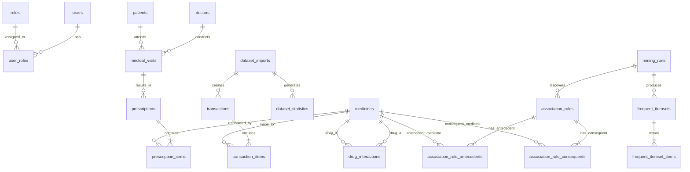

# THIẾT KẾ CƠ SỞ DỮ LIỆU (DATABASE DESIGN)

---

## 1. Tổng quan Thiết kế

Cơ sở dữ liệu của hệ thống được thiết kế theo chuẩn **3NF (Third Normal Form)** trên hệ quản trị cơ sở dữ liệu quan hệ **MySQL**, đáp ứng đồng thời hai mục tiêu:
1. **Quản lý vận hành bệnh viện lâm sàng**: Quản lý người dùng, bệnh nhân, bác sĩ, các lượt khám và đơn thuốc.
2. **Khai phá và lưu trữ tri thức Data Mining**: Quản lý dữ liệu nhập vào (Imports), phân phối dữ liệu (Statistics), tập giao dịch (Transactions), lịch sử khai phá (Mining Runs), tập mục phổ biến (Frequent Itemsets), các luật kết hợp (Association Rules) và bảng tra cứu tương tác thuốc (Drug Interactions).

---

## 2. Sơ đồ Thực thể Quan hệ (ERD - Entity Relationship Diagram)

---

## 3. Đặc tả Chi tiết Các Bảng trong CSDL

### 3.1. Phân hệ Quản trị & Người dùng

#### Bảng `users`
Lưu trữ tài khoản người dùng đăng nhập hệ thống.
* `id` (BIGINT, PK, AUTO_INCREMENT): Khóa chính
* `username` (VARCHAR(50), NOT NULL, UNIQUE): Tên đăng nhập
* `password` (VARCHAR(255), NOT NULL): Mật khẩu đã băm BCrypt
* `full_name` (VARCHAR(100), NOT NULL): Họ và tên đầy đủ
* `email` (VARCHAR(100)): Địa chỉ email
* `phone` (VARCHAR(20)): Số điện thoại
* `enabled` (BOOLEAN, DEFAULT TRUE): Trạng thái kích hoạt tài khoản
* `created_at`, `updated_at` (DATETIME): Dấu thời gian

#### Bảng `roles` & `user_roles`
* `roles`: `id`, `name` (ROLE_ADMIN, ROLE_DOCTOR), `description`
* `user_roles`: `user_id` (FK), `role_id` (FK)

---

### 3.2. Phân hệ Khám chữa bệnh & Kê đơn

#### Bảng `patients`
* `id` (BIGINT, PK, AUTO_INCREMENT): Mã bệnh nhân
* `patient_code` (VARCHAR(50), UNIQUE): Mã y tế
* `full_name` (VARCHAR(100), NOT NULL): Tên bệnh nhân
* `gender` (VARCHAR(10)): Giới tính (Male, Female, Other)
* `date_of_birth` (DATE): Ngày sinh
* `address` (VARCHAR(255)): Địa chỉ thường trú
* `phone` (VARCHAR(20)): Số điện thoại

#### Bảng `doctors`
* `id` (BIGINT, PK, AUTO_INCREMENT): Mã bác sĩ
* `user_id` (BIGINT, FK -> `users.id`): Liên kết tài khoản
* `doctor_code` (VARCHAR(50), UNIQUE): Mã bác sĩ
* `full_name` (VARCHAR(100), NOT NULL): Họ tên bác sĩ
* `specialty` (VARCHAR(100)): Chuyên khoa (Nội tiết, Tim mạch...)
* `department` (VARCHAR(100)): Khoa phòng công tác

#### Bảng `medical_visits`
* `id` (BIGINT, PK, AUTO_INCREMENT): Mã lượt khám
* `patient_id` (BIGINT, FK -> `patients.id`): Khóa ngoại bệnh nhân
* `doctor_id` (BIGINT, FK -> `doctors.id`): Khóa ngoại bác sĩ
* `visit_date` (DATETIME): Thời điểm khám
* `diagnosis` (VARCHAR(500)): Chẩn đoán lâm sàng
* `notes` (TEXT): Ghi chú diễn biến bệnh
* `status` (VARCHAR(20)): Trạng thái (PENDING, COMPLETED, CANCELLED)

#### Bảng `medicines`
Danh mục thuốc điều trị chuẩn hóa.
* `id` (BIGINT, PK, AUTO_INCREMENT): Khóa chính
* `code` / `drug_code` (VARCHAR(50), UNIQUE): Mã chuẩn thuốc (VD: METFORMIN, INSULIN)
* `name` / `drug_name` (VARCHAR(200), NOT NULL): Tên thương mại / tên thông dụng
* `generic_name` (VARCHAR(200)): Hoạt chất gốc
* `display_name` (VARCHAR(200)): Tên hiển thị đầy đủ
* `active` (BOOLEAN, DEFAULT TRUE): Trạng thái khả dụng
* `category` (VARCHAR(100)): Nhóm thuốc (Biguanide, Sulfonylurea...)
* `unit` (VARCHAR(50)): Đơn vị đóng gói (Viên, Lọ, Bút tiêm...)

#### Bảng `prescriptions` & `prescription_items`
* `prescriptions`: `id`, `visit_id` (FK), `patient_id` (FK), `doctor_id` (FK), `prescription_code`, `status`, `notes`, `created_at`
* `prescription_items`: `id`, `prescription_id` (FK), `medicine_id` (FK), `dosage`, `frequency`, `duration_days`, `instructions`

---

### 3.3. Phân hệ Nạp Dữ liệu & Thống kê (Data Understanding)

#### Bảng `dataset_imports`
Lưu vết từng lần nhập tệp dữ liệu y tế.
* `id` (BIGINT, PK, AUTO_INCREMENT): Mã đợt import
* `file_name` (VARCHAR(255), NOT NULL): Tên tệp nạp (VD: diabetic_data.csv)
* `source` (VARCHAR(100)): Nguồn dữ liệu (UCI Diabetes 130-US Hospitals)
* `total_rows` (INT): Tổng số dòng đọc được từ CSV
* `valid_rows` (INT): Số dòng hợp lệ
* `invalid_rows` (INT): Số dòng bị loại (thiếu trường, sai định dạng)
* `transaction_count` (INT): Số giao dịch hợp lệ ($\ge 2$ thuốc)
* `medicine_count` (INT): Số lượng thuốc duy nhất xuất hiện
* `status` (VARCHAR(50)): Trạng thái (SUCCESS, FAILED, PROCESSING)
* `created_at` (DATETIME): Thời điểm import

#### Bảng `dataset_statistics`
Lưu trữ các chỉ số phân tích Data Understanding của bộ dữ liệu.
* `id` (BIGINT, PK, AUTO_INCREMENT): Khóa chính
* `import_id` (BIGINT, FK -> `dataset_imports.id`): Liên kết đợt import
* `total_patients` (INT): Số bệnh nhân duy nhất
* `total_encounters` (INT): Số đợt điều trị
* `zero_drug_count` (INT): Số encounter không có thuốc
* `one_drug_count` (INT): Số encounter có 1 thuốc
* `multi_drug_count` (INT): Số encounter có $\ge 2$ thuốc
* `avg_drugs_per_encounter` (DOUBLE): Số thuốc trung bình
* `min_drugs_per_encounter` (INT): Số thuốc ít nhất
* `max_drugs_per_encounter` (INT): Số thuốc nhiều nhất
* `age_distribution_json` (TEXT): Tỷ lệ phần trăm theo nhóm tuổi dạng JSON
* `top_diagnoses_json` (TEXT): Top chẩn đoán ICD-9 dạng JSON
* `medication_count_distribution_json` (TEXT): Phân phối số lượng thuốc / encounter dạng JSON

---

### 3.4. Phân hệ Giao dịch Khai phá (Transactions)

#### Bảng `transactions`
Mỗi dòng đại diện cho một `encounter_id` thỏa mãn điều kiện $\ge 2$ thuốc.
* `id` (BIGINT, PK, AUTO_INCREMENT): Mã giao dịch nội bộ
* `encounter_id` (VARCHAR(100), NOT NULL): Mã lượt nằm viện gốc từ UCI
* `patient_reference` (VARCHAR(100)): Mã bệnh nhân gốc (`patient_nbr`)
* `source_import_id` (BIGINT, FK -> `dataset_imports.id`): Nguồn import
* `item_count` (INT, NOT NULL): Số lượng thuốc trong giao dịch này
* `created_at` (DATETIME): Thời điểm tạo

#### Bảng `transaction_items`
Chi tiết các thuốc xuất hiện trong giao dịch.
* `id` (BIGINT, PK, AUTO_INCREMENT): Khóa chính
* `transaction_id` (BIGINT, FK -> `transactions.id`, ON DELETE CASCADE): Mã giao dịch
* `medicine_id` (BIGINT, FK -> `medicines.id`, NULLABLE): Liên kết danh mục thuốc
* `drug_name` (VARCHAR(200), NOT NULL): Tên thuốc chuẩn hóa

---

### 3.5. Phân hệ Khai phá Luật kết hợp (Data Mining Engine)

#### Bảng `mining_runs`
Ghi lại lịch sử từng phiên thực thi thuật toán khai phá dữ liệu.
* `id` (BIGINT, PK, AUTO_INCREMENT): Khóa phiên chạy
* `algorithm` (VARCHAR(50), NOT NULL): Tên thuật toán (APRIORI, FP_GROWTH)
* `min_support` (DOUBLE, NOT NULL): Ngưỡng độ hỗ trợ tối thiểu
* `min_confidence` (DOUBLE, NOT NULL): Ngưỡng độ tin cậy tối thiểu
* `min_lift` (DOUBLE, DEFAULT 1.0): Ngưỡng độ nâng tối thiểu
* `max_itemset_size` (INT, DEFAULT 5): Kích thước tập mục tối đa
* `transaction_count` (INT): Số lượng giao dịch được nạp vào
* `frequent_itemset_count` (INT): Tổng số tập phổ biến tìm được
* `rule_count` (INT): Tổng số luật kết hợp sinh ra
* `runtime_ms` (BIGINT): Thời gian chạy (mili-giây)
* `memory_mb` (DOUBLE): Bộ nhớ tiêu thụ (MB)
* `status` (VARCHAR(20)): Trạng thái (SUCCESS, FAILED)
* `started_at`, `finished_at` (DATETIME): Thời gian bắt đầu và kết thúc

#### Bảng `frequent_itemsets` & `frequent_itemset_items`
* `frequent_itemsets`: `id`, `mining_run_id` (FK), `item_count`, `support_count`, `support`
* `frequent_itemset_items`: `itemset_id` (FK), `medicine_id` (FK -> `medicines.id`), `drug_name`

#### Bảng `association_rules`
Lưu trữ các luật kết hợp đã khai phá.
* `id` (BIGINT, PK, AUTO_INCREMENT): Khóa chính luật
* `mining_run_id` (BIGINT, FK -> `mining_runs.id`): Liên kết phiên chạy
* `support` (DOUBLE, NOT NULL): $\text{Support}(X \to Y)$
* `confidence` (DOUBLE, NOT NULL): $\text{Confidence}(X \to Y)$
* `lift` (DOUBLE, NOT NULL): $\text{Lift}(X \to Y)$
* `antecedent_size` (INT, NOT NULL): Số lượng thuốc vế trước ($|X|$)
* `consequent_size` (INT, NOT NULL): Số lượng thuốc vế sau ($|Y|$)
* `antecedent_str` (VARCHAR(500)): Chuỗi hiển thị vế trước (phục vụ xem nhanh)
* `consequent_str` (VARCHAR(500)): Chuỗi hiển thị vế sau
* `created_at` (DATETIME): Thời điểm tạo

#### Bảng `association_rule_antecedents` & `association_rule_consequents`
> **LÝ DO THIẾT KẾ CHUẨN HÓA:**
> Thay vì chỉ lưu antecedent và consequent dưới dạng chuỗi ghép "Metformin, Insulin", việc tách thành các bảng quan hệ liên kết trực tiếp với `medicine_id` cho phép:
> 1. Truy vấn ngược cực nhanh bằng chỉ mục (Index) khi bác sĩ chọn danh sách các thuốc trên giao diện kê đơn.
> 2. Đảm bảo toàn vẹn dữ liệu tham chiếu (Foreign Key Integrity).
> 3. Hỗ trợ truy vấn khớp tập hợp chính xác (Set Inclusion Query).

* `association_rule_antecedents`: `id`, `rule_id` (FK -> `association_rules.id`), `medicine_id` (FK -> `medicines.id`), `drug_name`
* `association_rule_consequents`: `id`, `rule_id` (FK -> `association_rules.id`), `medicine_id` (FK -> `medicines.id`), `drug_name`

---

### 3.6. Phân hệ Đánh giá Thuật toán & Tương tác Thuốc

#### Bảng `algorithm_benchmarks`
Lưu lại kết quả so sánh thực nghiệm giữa Apriori và FP-Growth trên các cấu hình khác nhau.
* `id` (BIGINT, PK, AUTO_INCREMENT)
* `run_timestamp` (DATETIME)
* `dataset_name` (VARCHAR(100))
* `transaction_count` (INT)
* `min_support` (DOUBLE)
* `min_confidence` (DOUBLE)
* `apriori_runtime_ms` (BIGINT)
* `apriori_memory_mb` (DOUBLE)
* `apriori_itemset_count` (INT)
* `apriori_rule_count` (INT)
* `fpgrowth_runtime_ms` (BIGINT)
* `fpgrowth_memory_mb` (DOUBLE)
* `fpgrowth_itemset_count` (INT)
* `fpgrowth_rule_count` (INT)
* `selected_algorithm` (VARCHAR(50)): Thuật toán được chọn vượt trội

#### Bảng `drug_interactions`
Tra cứu thông tin tương tác thuốc từ các nguồn công khai uy tín (FDA DDI, DailyMed).
* `id` (BIGINT, PK, AUTO_INCREMENT): Khóa chính
* `drug_a_id` (BIGINT, FK -> `medicines.id`, NULLABLE): Thuốc thứ nhất
* `drug_b_id` (BIGINT, FK -> `medicines.id`, NULLABLE): Thuốc thứ hai
* `drug_a_name` (VARCHAR(200), NOT NULL): Tên thuốc A
* `drug_b_name` (VARCHAR(200), NOT NULL): Tên thuốc B
* `severity` (VARCHAR(50), NOT NULL): Mức độ cảnh báo (`Major`, `Moderate`, `Minor`, `Contraindicated`)
* `description` (TEXT): Cơ chế tương tác và hướng dẫn lâm sàng
* `source` (VARCHAR(100)): Nguồn cảnh báo (FDA Drug-Drug Interaction, FAERS, DailyMed)
* `active` (BOOLEAN, DEFAULT TRUE)
