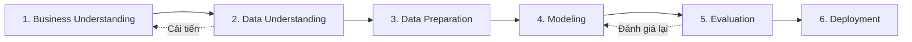

# QUY TRÌNH TRIỂN KHAI DATA MINING & MACHINE LEARNING (CRISP-DM)

---

## 1. Phương pháp Luận CRISP-DM

Đồ án tuân thủ chặt chẽ quy trình chuẩn quốc tế **CRISP-DM (Cross-Industry Standard Process for Data Mining)**, trải qua 6 giai đoạn phát triển liên hoàn:

---

## 2. Giai đoạn 1: Thấu hiểu Bài toán Nghiệp vụ (Business Understanding)

### 2.1. Đặt vấn đề trong thực tiễn y tế
Trong các cơ sở điều trị bệnh viện, đái tháo đường và các bệnh mạn tính liên quan thường đòi hỏi điều trị đa mô thức (polypharmacy). Bác sĩ thường phải phối hợp nhiều loại thuốc để kiểm soát đường huyết, huyết áp và các biến chứng đi kèm.
Tuy nhiên:
* Số lượng lượt điều trị tại các bệnh viện lên tới hàng chục, hàng trăm nghìn ca mỗi năm.
* Việc phát hiện thủ công các mẫu đồng kê đơn (co-prescription patterns) là hoàn toàn bất khả thi đối với con người.
* Các bác sĩ nội trú hoặc bác sĩ trẻ cần các công cụ tham khảo thực tế về các phác đồ phối hợp thuốc đã được sử dụng phổ biến trong lịch sử bệnh viện.

### 2.2. Giải pháp công nghệ Data Mining
Ứng dụng **Kỹ thuật Khai phá Luật Kết hợp (Association Rule Mining)** trên tập dữ liệu lịch sử các đợt điều trị lâm sàng nhằm:
1. Tự động trích xuất các tập thuốc thường xuyên được kê cùng nhau (Frequent Itemsets).
2. Phát hiện các luật kết hợp có dạng: $\{Thuốc_A, Thuốc_B\} \to \{Thuốc_C\}$ với các chỉ số thống kê định lượng rõ ràng ($\text{Support}$, $\text{Confidence}$, $\text{Lift}$).
3. Tích hợp trực tiếp các tri thức khai phá được vào phần mềm kê đơn bệnh viện để hỗ trợ bác sĩ tham khảo theo thời gian thực.

### 2.3. Bối cảnh Khoa học & Bài báo Tham khảo
Dự án được truyền cảm hứng và lấy cơ sở lý thuyết từ công trình nghiên cứu nổi tiếng:
* **Tatonetti, N. P., Patrick, P. B., Daneshjou, R., & Altman, R. B. (2012). Data-driven prediction of drug effects and interactions. Science Translational Medicine, 4(125), 125ra31.**

**Ý nghĩa và Liên hệ với Đề tài:**
* Nghiên cứu của TS. Tatonetti và cộng sự chứng minh rằng: **Dữ liệu y tế ghi nhận thực tế (Real-World Clinical Data / EHR) hoàn toàn có thể được khai thác theo hướng tiếp cận định hướng dữ liệu (data-driven) để phát hiện các tín hiệu (signals), mối quan hệ và hành vi sử dụng thuốc trên diện rộng**.
* Hướng nghiên cứu này tạo động lực cốt lõi cho bài toán của đồ án: khai phá mối quan hệ đồng kê đơn thuốc từ cơ sở dữ liệu đợt nằm viện.
* **Tuyên bố phạm vi phương pháp luận**: Đồ án ứng dụng kỹ thuật **Khai phá Luật Kết hợp (Association Rule Mining - Apriori & FP-Growth)**. Phương pháp của đồ án **không tuyên bố là tái hiện hoàn toàn mô hình hồi quy / cân bằng điểm xu hướng (propensity score matching) hay mạng lưới dược cảnh giác của Tatonetti**, mà vận dụng tư tưởng khai phá dữ liệu y tế của bài báo để giải quyết bài toán hỗ trợ kê đơn lâm sàng.

---

## 3. Giai đoạn 2: Thấu hiểu Dữ liệu (Data Understanding)

### 3.1. Nguồn dữ liệu & Tính pháp lý
* Bộ dữ liệu: **Diabetes 130-US Hospitals for Years 1999–2008 (UCI Machine Learning Repository)**.
* Tổng số bản ghi: **101,766 lượt điều trị** (encounters) của **71,518 bệnh nhân duy nhất**.
* Không sử dụng dữ liệu tự tạo làm kết quả nghiên cứu. Bộ dữ liệu này hoàn toàn phân biệt với MIMIC-III.

### 3.2. Cấu trúc trường dữ liệu & Định nghĩa Transaction
* Đơn vị giao dịch (Transaction): Mỗi `encounter_id` được xác định là một transaction đại diện cho một đợt nằm viện.
* 24 trường thuốc điều trị tiểu đường: `metformin`, `repaglinide`, `nateglinide`, `chlorpropamide`, `glimepiride`, `acetohexamide`, `glipizide`, `glyburide`, `tolbutamide`, `pioglitazone`, `rosiglitazone`, `acarbose`, `miglitol`, `troglitazone`, `tolazamide`, `examide`, `citoglipton`, `insulin`, `glyburide-metformin`, `glipizide-metformin`, `glimepiride-pioglitazone`, `metformin-rosiglitazone`, `metformin-pioglitazone`.

### 3.3. Phân tích Thống kê Dữ liệu (Data Understanding Dashboard)
Từ việc chạy thực tế trên 101,766 bản ghi:
* **Tỷ lệ nhóm tuổi**: Chiếm tỷ trọng cao nhất là nhóm người cao tuổi: `[70-80)` (25.6%), `[60-70)` (22.1%), `[50-60)` (16.9%).
* **Phân phối số lượng thuốc / encounter**:
  * 0 loại thuốc tiểu đường: 22,869 encounters (22.47%)
  * 1 loại thuốc tiểu đường: 47,848 encounters (47.02%)
  * $\ge 2$ loại thuốc tiểu đường: **31,049 encounters (30.51%)**
* **Số thuốc trung bình / encounter**: 1.18 thuốc (Tối đa: 6 thuốc).
* **Top thuốc xuất hiện nhiều nhất**: `Insulin` (54,383 lần), `Metformin` (20,245 lần), `Glipizide` (12,776 lần), `Glyburide` (10,698 lần), `Pioglitazone` (7,363 lần).

---

## 4. Giai đoạn 3: Tiền xử lý & Chuẩn bị Dữ liệu (Data Preparation)

Quy trình tiền xử lý được triển khai tuần tự trong Java:
1. **Kiểm tra Header & Validation**: Xác thực cấu trúc file CSV; kiểm tra sự hiện diện bắt buộc của `encounter_id` và các cột thuốc.
2. **Loại bỏ bản ghi không hợp lệ**: Lọc các dòng thiếu `encounter_id`, dòng trống hoặc lỗi định dạng CSV.
3. **Chuẩn hóa giá trị thuốc**:
   * Áp dụng quy ước chuyên ngành:
     * `No` $\to$ Bỏ qua (không sử dụng).
     * `Steady`, `Up`, `Down` $\to$ Giữ lại (có sử dụng trong đợt điều trị).
4. **Xây dựng tập giao dịch (Transaction Building)**:
   * Tập hợp các thuốc có sử dụng trong cùng một `encounter_id` thành một tập hợp (Set).
   * Chuẩn hóa danh xưng thuốc theo chuẩn Title Case (`Metformin`, `Insulin`, `Glipizide`...).
5. **Lọc giao dịch cho bài toán Luật kết hợp**:
   * **Loại bỏ các giao dịch có $< 2$ thuốc**: Vì bài toán luật kết hợp đồng sử dụng thuốc đòi hỏi ít nhất 2 mục để hình thành quan hệ $\{X\} \to \{Y\}$.
   * Kết quả: Thu được **31,049 transactions hợp lệ** từ 101,766 encounter ban đầu.
6. **Lưu trữ CSDL**: Batch insert các giao dịch vào bảng `transactions` và `transaction_items` trong MySQL.

---

## 5. Giai đoạn 4: Xây dựng Mô hình (Modeling)

Triển khai hai thuật toán khai phá luật kết hợp độc lập thuần Java 100%:

### 5.1. Thuật toán Apriori (`AprioriMiningService`)
* **Nguyên lý Apriori**: Mọi tập con của một tập mục phổ biến đều phải là tập mục phổ biến. Nếu một tập mục không phổ biến, mọi tập cha của nó cũng không phổ biến.
* **Cơ chế**: Lặp theo từng mức kích thước $k$ ($k=1, 2, \dots$):
  1. Sinh tập ứng viên $C_k$ bằng phép kết hợp $L_{k-1} \Join L_{k-1}$.
  2. Cắt tỉa (Pruning) các ứng viên có tập con không thuộc $L_{k-1}$.
  3. Quét toàn bộ tập giao dịch để đếm số lần xuất hiện của các ứng viên thỏa mãn điều kiện cắt tỉa.
  4. Giữ lại các ứng viên có $\text{Support} \ge \text{minSupport}$ để tạo thành $L_k$.

### 5.2. Thuật toán FP-Growth (`FPGrowthMiningService`)
* **Cơ chế không sinh tập ứng viên**:
  1. Lượt quét 1: Đếm tần suất các 1-itemset, lọc bỏ các item không phổ biến, sắp xếp các item theo thứ tự tần suất giảm dần.
  2. Lượt quét 2: Nạp các giao dịch đã sắp xếp vào cấu trúc cây nén **FP-Tree (Frequent Pattern Tree)**, liên kết các nút cùng tên qua danh sách liên kết Header Table.
  3. Khai phá đệ quy trên cây: Duyệt từ đáy Header Table lên đỉnh, xây dựng cơ sở mẫu điều kiện (Conditional Pattern Base) và cây FP-Tree điều kiện (Conditional FP-Tree) để trực tiếp sinh ra các tập phổ biến.

---

## 6. Giai đoạn 5: Đánh giá Mô hình (Evaluation)

### 6.1. Các chỉ số Đánh giá Chất lượng Luật
1. **Độ hỗ trợ (Support)**:
   $$\text{Support}(X \to Y) = \frac{\text{count}(X \cup Y)}{N}$$
   *Tần suất xuất hiện đồng thời của cả thuốc $X$ và thuốc $Y$ trên toàn bộ tập giao dịch.*

2. **Độ tin cậy (Confidence)**:
   $$\text{Confidence}(X \to Y) = \frac{\text{Support}(X \cup Y)}{\text{Support}(X)} = \frac{\text{count}(X \cup Y)}{\text{count}(X)}$$
   *Xác suất có điều kiện bác sĩ kê thêm thuốc $Y$ khi bệnh nhân đã được chỉ định thuốc $X$.*

3. **Độ nâng (Lift)**:
   $$\text{Lift}(X \to Y) = \frac{\text{Confidence}(X \to Y)}{\text{Support}(Y)} = \frac{\text{Support}(X \cup Y)}{\text{Support}(X) \times \text{Support}(Y)}$$
   * **$\text{Lift} > 1$**: $X$ và $Y$ có xu hướng đồng xuất hiện thực tế cao hơn so với việc hai thuốc được kê một cách độc lập ngẫu nhiên. Mối liên kết đồng xuất hiện là dương tính.
   * **$\text{Lift} = 1$**: Việc kê thuốc $X$ và thuốc $Y$ độc lập với nhau.
   * **$\text{Lift} < 1$**: $X$ và $Y$ ít xuất hiện cùng nhau hơn kỳ vọng ngẫu nhiên (có thể là thay thế lẫn nhau hoặc chống chỉ định phối hợp).

> **LƯU Ý KHOA HỌC LÂM SÀNG CỰC KỲ QUAN TRỌNG:**
> Chỉ số $\text{Lift} > 1$ **hoàn toàn KHÔNG đồng nghĩa với việc hai thuốc an toàn khi phối hợp**. $\text{Lift} > 1$ chỉ phản ánh tương quan đồng xuất hiện thống kê trong dữ liệu lịch sử, không chứng minh mối quan hệ nhân quả (causality) hay độ an toàn lâm sàng (clinical safety).

### 6.2. Kết quả Thực nghiệm & Lựa chọn Thuật toán
Trên tập dữ liệu đầy đủ 31,049 transactions của UCI Diabetes 130-US Hospitals:
* Hai thuật toán sinh ra số lượng tập phổ biến và luật kết hợp **trùng khớp 100%** tại mọi ngưỡng $\text{minSupport}$.
* **FP-Growth vượt trội hoàn toàn về tốc độ thực thi**: Nhanh hơn Apriori từ **3.5 đến 4.2 lần** (ở $\text{minSupport}=0.01$, FP-Growth chỉ mất 81 ms trong khi Apriori mất 339 ms).
* **Kết luận khoa học**: FP-Growth được lựa chọn làm thuật toán ưu tiên khuyến nghị cho hệ thống nhờ khả năng mở rộng tốt trên tập dữ liệu lớn.

---

## 7. Giai đoạn 6: Triển khai Ứng dụng Thực tế (Deployment)

Dự án không dừng lại ở mức phân tích lý thuyết hay vẽ đồ thị tĩnh mà đã **triển khai hoàn chỉnh vào quy trình kê đơn của bác sĩ**:
1. Bác sĩ mở màn hình khám bệnh, tạo đơn thuốc và chọn thuốc khởi đầu (ví dụ: `Metformin`).
2. Hệ thống tự động kích hoạt `DrugRecommendationService`:
   * Ưu tiên tìm các luật đa tiền tố (nếu bác sĩ đã chọn nhiều thuốc).
   * Tự động fallback sang các luật đơn tiền tố để đảm bảo độ phủ gợi ý.
   * Lọc bỏ các thuốc đã có trong đơn hiện tại.
   * Sắp xếp danh sách gợi ý theo $\text{Lift} \downarrow$, $\text{Confidence} \downarrow$, $\text{Support} \downarrow$.
3. Tích hợp kiểm tra tương tác thuốc FDA DDI độc lập qua `DrugInteractionService` để cảnh báo mức độ tương tác nếu có (`Major`, `Moderate`, `Minor`).
4. Hiển thị thông báo miễn trừ trách nhiệm y khoa bắt buộc để bác sĩ đưa ra quyết định lâm sàng cuối cùng.
